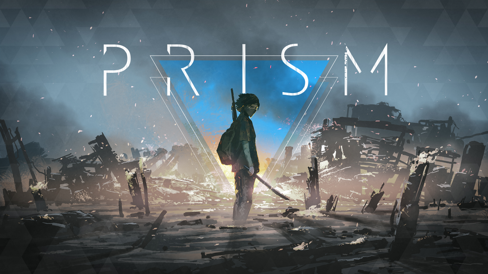

# PRISM RPG for Foundry Virtual Tabletop

**An unofficial game-system implementation for playing PRISM RPG on Foundry Virtual Tabletop.**

  

> [!IMPORTANT]
> This is an **unofficial fan-made implementation**. It is not affiliated with, endorsed by, or sponsored by Claudio Pustorino, the publishers of PRISM RPG, Foundry Gaming LLC, or the Foundry Virtual Tabletop team.

---

## Table of Contents

* [About PRISM](#about-prism)
* [About This System](#about-this-system)
* [Features](#features)
* [Project Status](#project-status)
* [Installation](#installation)
* [Compatibility](#compatibility)
* [Localization](#localization)
* [Documentation](#documentation)
* [Community and Contributions](#community-and-contributions)
* [Supporting PRISM](#supporting-prism)
* [License and Intellectual Property](#license-and-intellectual-property)
* [Credits](#credits)

---

## About PRISM

**PRISM** is a focused dystopian tabletop roleplaying game created by **Claudio Pustorino**.

Players portray Anomalies: people who do not conform to the rules and expectations of a dystopian society.

Rather than using dice as its primary resolution mechanic, PRISM uses writable tokens or tags. Character traits and other narrative elements are represented by words placed into a physical bag.

When a test must be resolved, the relevant tags are added to the bag and drawn randomly. The selected words become prompts that guide the outcome and the development of the story.

Official information and legally distributed copies of PRISM are available from:

* [Claudio Pustorino — Official Website](https://claudiopustorino.com/)
* [PRISM on Fumble GDR’s itch.io page](https://fumblegdr.itch.io/prism)
* [PRISM from FUMBLE GDR](https://www.fumblegdr.it/giochi/prism/)

---

## About This System

This project brings PRISM’s Anomaly sheet and tag-based gameplay workflow into **Foundry Virtual Tabletop**.

It is intended to support online and remote play while preserving the core process of selecting tags, placing them into a bag, drawing a result, and using that result as a narrative prompt.

The project focuses on digital tools and gameplay support. It does not reproduce or redistribute the complete text, artwork, layout, or commercial content of the original PRISM publications.

---

## Features

### Anomaly Sheet

Create and manage an Anomaly directly inside Foundry VTT.

The sheet provides a centralized interface for character information and the tags required during play.

### Tag Management

Create, edit, organize, and select the tags associated with an Anomaly.

Selected tags can then be used in the system’s digital resolution workflow.

### Virtual Bag

Add the tags involved in a test to a virtual bag and draw them through Foundry VTT.

The virtual bag is designed to reproduce the essential workflow of PRISM’s physical tag-based mechanic for online sessions.

### Chat Integration

Send draw results directly to Foundry VTT chat so that every participant can see and interpret the selected narrative prompts.

### Localization

Use the system interface in English or Italian.

Additional languages can be added through the project’s localization framework.

---

## Screenshots

<!--
Store documentation images in:

docs/images/

Suggested files:

docs/images/anomaly-sheet.webp
docs/images/tag-management.webp
docs/images/virtual-bag.webp
docs/images/chat-result.webp

Uncomment the relevant blocks after adding the images.
-->

<!--
### Anomaly Sheet

-->

<!--
### Tag Management

-->

<!--
### Virtual Bag

-->

<!--
### Chat Result

-->

Additional screenshots and demonstrations will be added as the Alpha interface becomes more stable.

---

## Project Status

> [!WARNING]
> PRISM RPG for Foundry VTT is currently in **Alpha development**.

The project is available for development and testing, but it should not yet be considered stable.

During the Alpha phase:

* Features may be incomplete.
* Existing features may be redesigned.
* The Anomaly sheet layout may change.
* Actor and system data structures may change.
* Existing worlds may require migration after an update.
* Backward compatibility is not guaranteed.
* Some game procedures may still require manual handling.
* Bugs and unexpected behavior should be expected.

Create regular backups of Foundry VTT worlds and user data. Do not use the Alpha version as the only copy of important campaign information.

### Current Development Priorities

Current development focuses on:

* Improving the usability of the Anomaly sheet.
* Making the interface more intuitive and user-friendly.
* Improving the virtual bag workflow.
* Adding validation and control logic.
* Expanding gameplay automation.
* Improving chat-message presentation.
* Improving Foundry VTT compatibility.
* Expanding localization support.

Priorities may change based on technical requirements, testing results, and community feedback.

---

## Installation

The project does not currently provide a stable manifest intended for general installation.

During Alpha development, installation is primarily intended for developers and testers.

Read the complete instructions in the:

**[Installation Guide](docs/INSTALLATION.md)**

Before installing or updating:

1. Review the compatibility information in [`system.json`](system.json).
2. Check the latest project changes or release notes.
3. Back up existing Foundry VTT worlds.
4. Remember that development versions may introduce breaking changes.

A stable manifest URL will be documented here when packaged releases become available.

---

## Compatibility

Foundry VTT compatibility may change during Alpha development.

The authoritative compatibility values for the current version are defined in:

* [`system.json`](system.json)
* The relevant [GitHub release notes](https://github.com/Heldan-oss/PRISM-System/releases), once releases are available

Compatibility with Foundry VTT versions not explicitly declared in `system.json` is not guaranteed.

| Component                 | Current status              |
| ------------------------- | --------------------------- |
| Development stage         | Alpha                       |
| Foundry VTT compatibility | See `system.json`           |
| English localization      | Available                   |
| Italian localization      | Available                   |
| Additional languages      | Open to contributions       |
| Stable release manifest   | Not yet available           |
| World-data compatibility  | Not guaranteed during Alpha |

---

## Localization

The system currently supports:

* English
* Italian

Additional translations are welcome.

Translation files, terminology conventions, testing requirements, and instructions for adding a new language are documented in the:

**[Localization Guide](docs/LOCALIZATION.md)**

---

## Documentation

This README is the main entry point for the project. Detailed procedures and policies are maintained in dedicated documents.

| Document                                   | Purpose                                                                             |
| ------------------------------------------ | ----------------------------------------------------------------------------------- |
| [Installation Guide](docs/INSTALLATION.md) | Installation, updates, backups, removal, and troubleshooting                        |
| [Contributing Guidelines](CONTRIBUTING.md) | Forks, branches, commits, Pull Requests, reviews, and contribution rules            |
| [Development Guide](docs/DEVELOPMENT.md)   | Project structure, development setup, coding conventions, testing, and data changes |
| [Localization Guide](docs/LOCALIZATION.md) | Translation files, localization keys, terminology, and new languages                |
| [Changelog](CHANGELOG.md)                  | Notable project changes organized by version                                        |
| [License](LICENSE)                         | Terms governing use and redistribution of the repository source code                |

---

## Community and Contributions

This is a public repository, and community participation is welcome.

### Reporting Bugs

Use the repository’s:

**[Bug Report form](https://github.com/Heldan-oss/PRISM-System/issues/new/choose)**

Before reporting a problem, search existing Issues and test with unrelated Foundry modules disabled whenever possible.

Security vulnerabilities must not be reported publicly. Follow the [Security Policy](SECURITY.md).

### Requesting Features

Use the repository’s:

**[Feature Request form](https://github.com/Heldan-oss/PRISM-System/issues/new/choose)**

Major, breaking, or data-model changes should be discussed before implementation.

### Questions and Support

Use:

* [GitHub Discussions](https://github.com/Heldan-oss/PRISM-System/discussions) for general questions, installation help, and community discussion.
* [GitHub Issues](https://github.com/Heldan-oss/PRISM-System/issues) for reproducible bugs and concrete feature requests.

Do not use public Discussions or Issues for security vulnerabilities. Follow the [Security Policy](SECURITY.md).

### Contributing Code or Documentation

External contributors should work from a fork and submit changes through a Pull Request.

Invited collaborators may create branches directly in the original repository, but they must still use the Pull Request workflow.

The `main` branch is protected. Changes require review and approval before they can be merged.

Read the complete process in the:

**[Contributing Guidelines](CONTRIBUTING.md)**

Opening a Pull Request does not guarantee that it will be accepted or merged. Maintainers may request changes or close contributions that are outside the project scope, unsafe, incomplete, inactive, incompatible, or inconsistent with the project’s direction.

---

## Supporting PRISM

This Foundry VTT implementation is not a substitute for the original game.

The most direct way to support PRISM is to obtain the official game and follow the work of its creator and publishing partners:

* [Claudio Pustorino — Official Website](https://claudiopustorino.com/)
* [PRISM on itch.io](https://fumblegdr.itch.io/prism)
* [PRISM from FUMBLE GDR](https://www.fumblegdr.it/giochi/prism/)

Do not use this repository to request, share, or redistribute unauthorized copies of PRISM publications or commercial assets.

You can support this Foundry VTT project by:

* Reporting reproducible bugs.
* Testing Alpha versions.
* Suggesting focused improvements.
* Improving documentation.
* Contributing code.
* Correcting translations.
* Adding new localizations.
* Reviewing Pull Requests.
* Sharing the project with PRISM players.

---

## License and Intellectual Property

### Repository Source Code

The source code and associated documentation created for this repository are distributed under the:

**[MIT License](LICENSE)**

The MIT License applies only to material covered by the repository license. It does not grant rights to PRISM RPG, Foundry Virtual Tabletop, or third-party content.

### PRISM RPG

PRISM, its rules, setting material, terminology, publications, artwork, graphic design, and associated intellectual property belong to their respective authors, publishers, artists, and rights holders.

This repository is an unofficial technical implementation intended to support legally obtained copies of the original game.

Unless explicit redistribution permission has been granted, this repository and its contributions must not include:

* Copies or scans of the original rulebook.
* Substantial text extracted from commercial publications.
* Commercial PDF content.
* Published artwork or graphic assets.
* Proprietary layouts.
* Unauthorized fonts.
* Other protected materials distributed with paid PRISM products.

### Foundry Virtual Tabletop

Foundry Virtual Tabletop, Foundry VTT, and associated software, names, and trademarks belong to Foundry Gaming LLC and their respective rights holders.

This project is independently maintained and is not an official Foundry VTT product.

---

## Credits

### Original Game

**PRISM RPG** was created by **Claudio Pustorino**.

All rights to the original game and its published materials remain with their respective rights holders.

### Foundry VTT Implementation

This unofficial Foundry Virtual Tabletop implementation was initiated and is maintained by:

* [Heldan-oss](https://github.com/Heldan-oss)

Additional contributors are recorded through the repository’s Git history and [GitHub Contributors](https://github.com/Heldan-oss/PRISM-System/graphs/contributors) page.

---

## Acknowledgements

Thanks to:

* Claudio Pustorino for creating PRISM.
* The people and organizations involved in publishing and supporting the original game.
* The Foundry Virtual Tabletop developer community.
* Everyone who reports bugs, tests Alpha versions, improves translations, reviews code, or contributes changes.

---

**PRISM RPG for Foundry Virtual Tabletop**

Unofficial community implementation.

